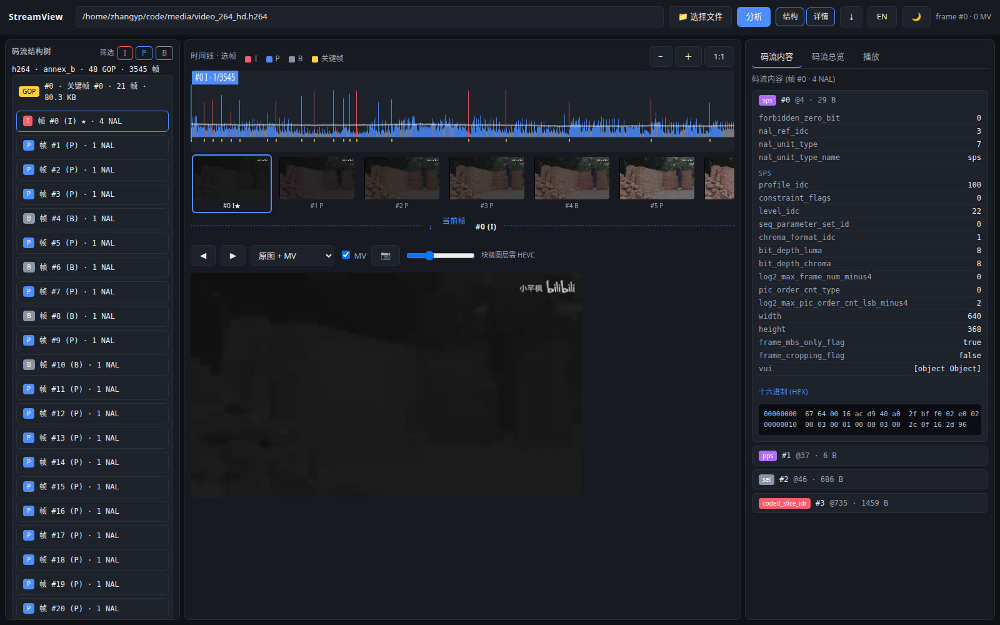
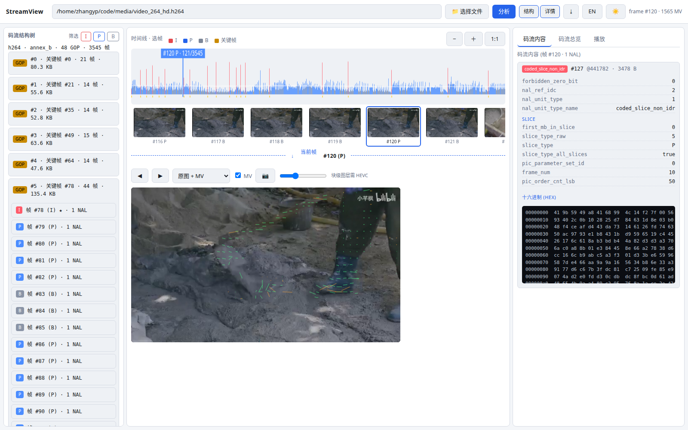

# StreamView Lite

StreamView 是一个面向 H.264/H.265 视频码流的桌面分析工具。它可以帮助你查看码流的时间线、帧类型、GOP、NAL 单元、解析字段、十六进制数据、解码缩略图和运动矢量。

当前发布目标是 Windows x64 桌面版，使用 Tauri 打包，安装后不需要单独安装 Node.js 或 FFmpeg。

## 界面预览





## 下载 Windows 版本

打开 GitHub 仓库的 **Releases** 页面，选择最新版本：

- `StreamView-*-x64-setup.exe` 或 `.msi`：安装版，推荐普通用户使用。
- `StreamView-*-windows-x64-portable.zip`：免安装版，解压后运行 `run.bat`。
- `SHA256SUMS.txt`：安装包校验值。

Windows 10/11 x64 建议安装 WebView2 Runtime。如果系统已经安装 Microsoft Edge，通常已经具备该运行时。

## 快速开始

### 安装版

1. 下载并运行安装包。
2. 启动 StreamView。
3. 点击“选择文件”，或者把视频码流拖入窗口。
4. 选择文件后会自动开始分析。
5. 点击时间线中的帧，查看帧详情、缩略图、运动矢量和对应 NAL。

### 免安装版

1. 解压 portable ZIP 到一个目录。
2. 双击 `run.bat`。
3. 浏览器打开后使用 StreamView Web 界面。
4. 关闭时可以关闭浏览器页面和命令窗口。

## 支持的输入

| 类型 | 支持内容 |
| --- | --- |
| H.264 | `.h264`、`.264` Annex B 裸流 |
| H.265/HEVC | `.h265`、`.265`、`.hevc` Annex B 裸流 |
| 容器 | `.mp4`、`.mov`、`.m4v`、`.mkv`、`.webm`、`.ts` |

容器输入由内置 FFmpeg 负责读取，分析结果仍然使用 StreamView 自己的码流分析模型。

## 主要功能

- H.264/H.265 NAL 单元扫描和基础语法解析。
- SPS/PPS/VPS、slice、SEI 等已支持字段的展开查看。
- 帧类型、帧大小、关键帧、GOP 和帧大小趋势时间线。
- 点击时间线、左侧帧列表或缩略图浏览帧。
- 解码当前帧并显示缩略图。
- H.264 运动矢量叠加。
- NAL 内容、解析字段和 Hex 数据查看。
- 码流一致性检查。
- 导出当前帧 PNG 和完整分析 JSON。
- 中英文界面、深色/浅色主题、可调整面板布局。

## HEVC 块级图层说明

QP、CB 分区、帧内预测和 HEVC 运动图层依赖 libde265。为了让 Windows Lite 安装包保持独立和稳定，官方 Windows Lite 包默认不包含该可选依赖。

这不影响普通 H.264/H.265 分析、解码缩略图、播放和 H.264 运动矢量功能。带 libde265 的自定义构建可以启用这些图层。

## 常见问题

### 选择文件后没有画面

先确认文件确实是视频码流或包含视频流的容器。对于非常规格式，可以尝试先用 FFmpeg 转成 `.h264` 或 `.h265` Annex B 裸流。

### Windows 提示端口被占用

StreamView 桌面后端默认使用本机 `8799` 端口。关闭其他 StreamView 实例，或结束占用该端口的程序后重新启动。

### 看到解析 warning 是不是视频坏了

不一定。编码器经常会在关键帧前重复发送参数集。StreamView 只会把“同一参数集 ID 的内容发生变化”作为参数集重定义 warning；FFmpeg 能播放也不等于所有语法字段都已经被 StreamView 解析。

## 从源码构建

核心工程使用 CMake 和 C++20。Windows CI 会自动下载 FFmpeg、构建 CLI、运行测试，并打包 Tauri 安装程序。

Linux/macOS 上构建核心 CLI：

```bash
cmake -S . -B build -DCMAKE_BUILD_TYPE=Release
cmake --build build --parallel
ctest --test-dir build --output-on-failure
```

本地启动 Web 版：

```bash
cmake -S . -B build
cmake --build build --parallel
cd apps/streamview-web
node server.js
```

浏览器打开 `http://127.0.0.1:8787`。

## GitHub 发布

推送版本标签后，GitHub Actions 会自动编译并创建 Windows Release：

```bash
git tag v0.1.0
git push origin v0.1.0
```

工作流会执行 C++ 测试、Web 后端健康检查、Tauri 打包，并上传安装版、免安装版和 SHA-256 校验文件。

## 当前边界

这是 StreamEye Lite 版本，不是完整的 H.264/H.265 标准验证器，也不提供 H.264 宏块级 QP、残差和完整预测模式解析。解析器会逐步扩展，每项语法扩展都会配套测试或 golden 输出。

许可证见 [LICENSE](LICENSE)。
